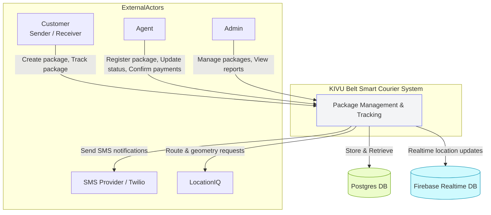

# Level 0 DFD — KIVU Belt Smart Courier Go Truck

This document describes a Level 0 (context) Data Flow Diagram for the KIVU Belt Smart Courier Go Truck project. It shows the system as a single process and its interactions with external actors and data stores.

Summary:
- External actors: Customers (senders/receivers), Agents (register packages, confirm payments, update statuses), Admin (reports and management), SMS provider (Twilio), Location service (LocationIQ).
- Main system: accepts package registrations, manages payments, tracks GPS updates, sends notifications, and stores data in Postgres + Firebase for realtime.

Key data stores:
- Postgres (packages, payments, users, tracking, branches, notifications)
- Firebase Realtime DB (vehicle live positions)

This Level 0 DFD intentionally simplifies internal processes to a single system box that communicates with external actors and data stores.
