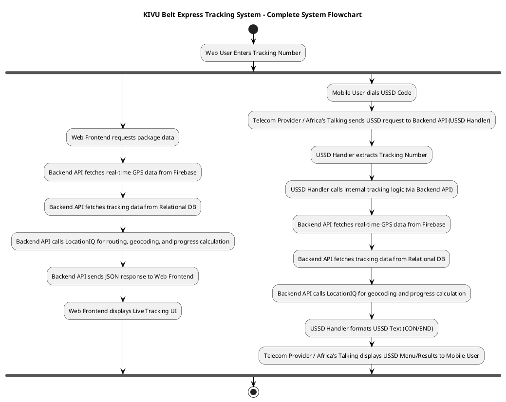
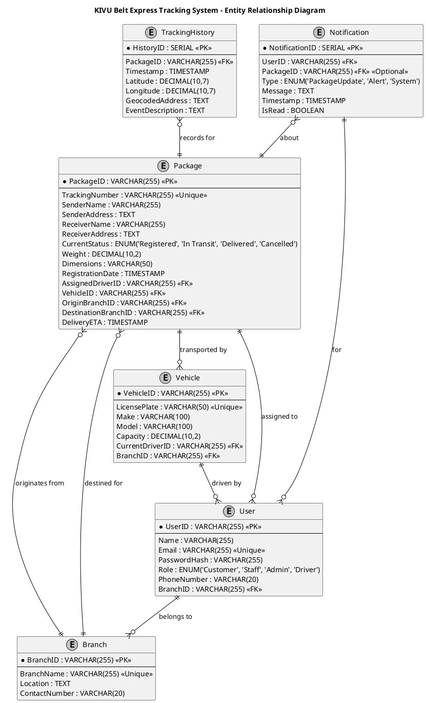
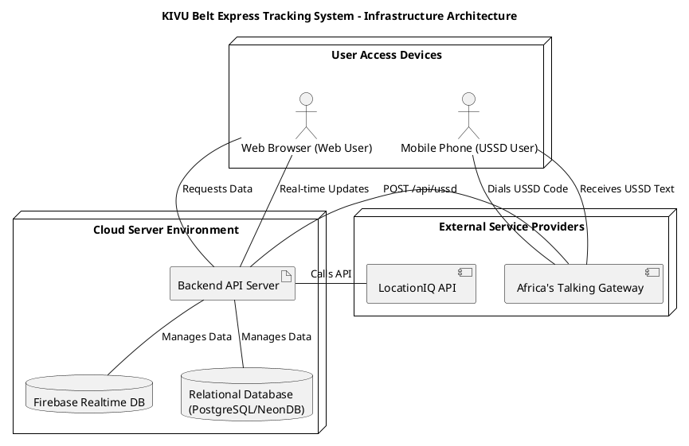
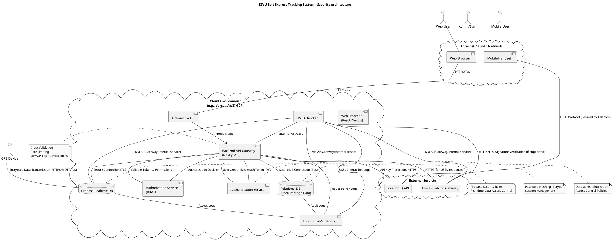
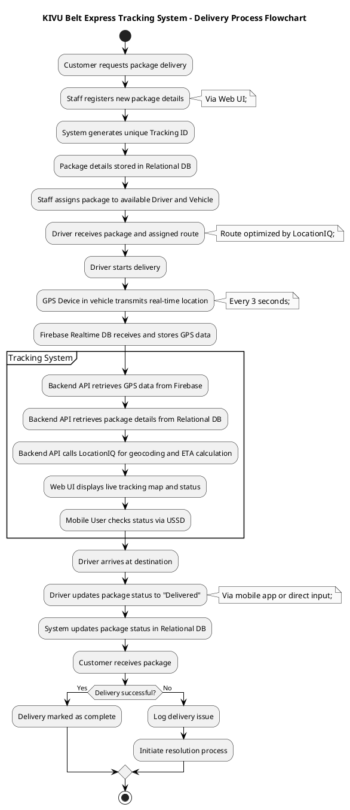
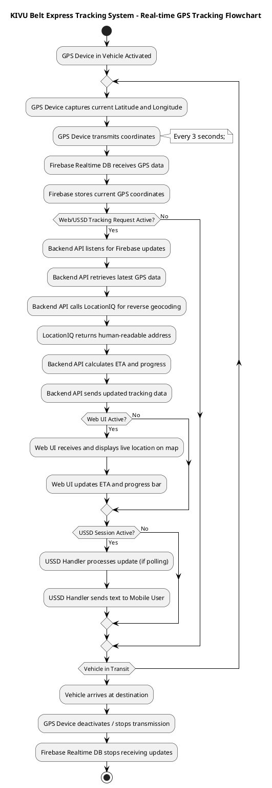
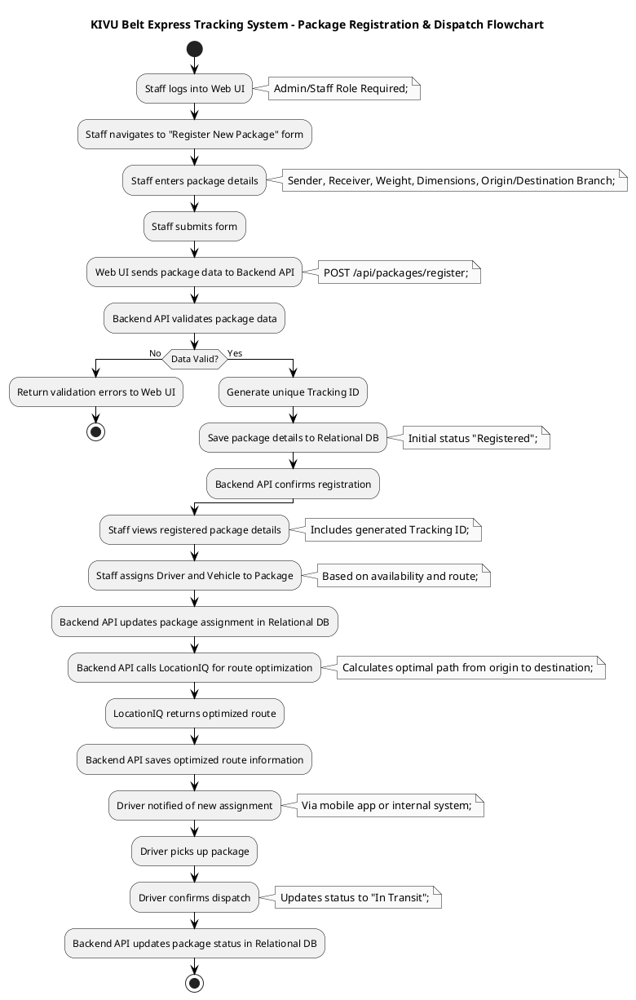

# KIVU Belt Express Tracking System - PlantUML Diagrams

## 1. Complete System Flowchart



## 2. Data Flow Diagram

```plantuml
@startuml
title KIVU Belt Express Tracking System - Data Flow Diagram

skinparam monochrome true
skinparam shadowing false
skinparam actorBorderColor black
skinparam actorFontColor black
skinparam rectangleBorderColor black
skinparam rectangleFontColor black
skinparam databaseBorderColor black
skinparam databaseFontColor black
skinparam cloudBorderColor black
skinparam cloudFontColor black

actor "Web User" as WebUser
actor "Mobile User" as MobileUser
actor "GPS Device (Vehicle)" as GPSDevice

rectangle "KIVU Belt Express System" {
    rectangle "Web Frontend" as WebFE
    rectangle "Backend API" as BackendAPI
    rectangle "USSD Handler" as USSDHandler
    
    database "Firebase Realtime DB" as FirebaseDB
    database "Relational DB (Package/User Data)" as RelationalDB
}

actor "LocationIQ API" as LocationIQ
actor "Africa's Talking Gateway" as AfricasTalking

WebUser -- 1. Package Tracking Request --> WebFE
WebFE -- 2. Tracking Number --> BackendAPI
BackendAPI -- 3. Request Real-time GPS Data --> FirebaseDB
FirebaseDB -- 4. Real-time GPS Coordinates --> BackendAPI
BackendAPI -- 5. Request Package Details/History --> RelationalDB
RelationalDB -- 6. Package Details/History --> BackendAPI
BackendAPI -- 7. Request Geocoding/Routing --> LocationIQ
LocationIQ -- 8. Geocoded Address/Route/ETA --> BackendAPI
BackendAPI -- 9. Formatted Tracking Data --> WebFE
WebFE -- 10. Display Live Tracking UI --> WebUser

MobileUser -- 11. USSD Code Dial --> AfricasTalking
AfricasTalking -- 12. USSD Request (Tracking No.) --> USSDHandler
USSDHandler -- 13. Process Tracking Request --> BackendAPI : (Internal Call)
BackendAPI -- 14. Request Real-time GPS Data --> FirebaseDB
FirebaseDB -- 15. Real-time GPS Coordinates --> BackendAPI
BackendAPI -- 16. Request Package Details/History --> RelationalDB
RelationalDB -- 17. Package Details/History --> BackendAPI
BackendAPI -- 18. Request Geocoding/Routing --> LocationIQ
LocationIQ -- 19. Geocoded Address/Route/ETA --> BackendAPI
USSDHandler -- 20. Formatted USSD Response --> AfricasTalking
AfricasTalking -- 21. Display USSD Text --> MobileUser

GPSDevice -- 22. Transmits GPS Data --> FirebaseDB : (every 3 seconds)

@enduml
```

## 3. Web Package Tracking Sequence Diagram

```plantuml
@startuml
title KIVU Belt Express Tracking System - Web Package Tracking Sequence

skinparam monochrome true
skinparam shadowing false
skinparam actorBorderColor black
skinparam actorFontColor black
skinparam participantBorderColor black
skinparam participantFontColor black

actor "Web User" as User
participant "Web Frontend
(Browser UI)" as WebUI
participant "Backend API
(Next.js API)" as Backend
database "Firebase Realtime DB" as Firebase
database "Relational DB
(Package/User Data)" as Relational
collections "LocationIQ API" as LocationIQ

autonumber

User->WebUI: Accesses Tracking Interface
User->WebUI: Enters Package Tracking Number
WebUI->Backend: GET /api/tracking/{trackingNo}

activate Backend
Backend->Relational: Query Package Details (initial load)
activate Relational
Relational-->Backend: Package Details, Status, History
deactivate Relational

Backend->Firebase: Request Current GPS Location (every 3s)
activate Firebase
Firebase-->Backend: Real-time GPS Coordinates
deactivate Firebase

Backend->LocationIQ: Request Geocoded Address, Route, ETA
activate LocationIQ
LocationIQ-->Backend: Geocoded Address, Route, Estimated Time

Backend-->WebUI: Initial Package Data (JSON)
deactivate Backend

WebUI->User: Displays Package Details, Map, History, Progress

loop Real-time Updates
    WebUI->Backend: Poll for Updates (e.g., every 5s)
    activate Backend
    Backend->Firebase: Request Latest GPS Location (every 3s)
    activate Firebase
    Firebase-->Backend: Latest GPS Coordinates
    deactivate Firebase
    Backend->LocationIQ: Update Geocoding, Route, ETA
    activate LocationIQ
    LocationIQ-->Backend: Updated Geocoded Address, Route, Estimated Time
    deactivate LocationIQ
    Backend-->WebUI: Updated Package Data (JSON)
    deactivate Backend
    WebUI->User: Updates Live Tracking Map and Details
end

@enduml
```

## 4. USSD Tracking Sequence Diagram

```plantuml
@startuml
title KIVU Belt Express Tracking System - USSD Tracking Sequence

skinparam monochrome true
skinparam shadowing false
skinparam actorBorderColor black
skinparam actorFontColor black
skinparam participantBorderColor black
skinparam participantFontColor black

actor "Mobile User" as MobileUser
participant "Africa's Talking Gateway" as AfricasTalking
participant "Backend API
(USSD Handler)" as USSDHandler
database "Firebase Realtime DB" as Firebase
database "Relational DB
(Package/User Data)" as Relational
collections "LocationIQ API" as LocationIQ

autonumber

MobileUser->AfricasTalking: Dials USSD Code (*123#)
AfricasTalking->USSDHandler: POST /api/ussd (sessionId, serviceCode, phoneNumber, text=" ")
activate AfricasTalking
activate USSDHandler

USSDHandler-->AfricasTalking: CON Welcome to KIVU Belt Express. Enter tracking number:
AfricasTalking->MobileUser: Displays Welcome Message & Prompt

MobileUser->AfricasTalking: Enters Tracking Number (e.g., *123*TRACK123#)
AfricasTalking->USSDHandler: POST /api/ussd (sessionId, serviceCode, phoneNumber, text="TRACK123")

USSDHandler->Backend: Call internal tracking logic (TRACK123)
activate Backend
Backend->Relational: Query Package Details
activate Relational
Relational-->Backend: Package Details, Status, History
deactivate Relational

Backend->Firebase: Request Current GPS Location
activate Firebase
Firebase-->Backend: Real-time GPS Coordinates
deactivate Firebase

Backend->LocationIQ: Request Geocoded Address
activate LocationIQ
LocationIQ-->Backend: Geocoded Address, Progress
deactivate LocationIQ

Backend-->USSDHandler: Formatted Tracking Data
deactivate Backend

USSDHandler-->AfricasTalking: END Package Status: In Transit, Loc: [Address], Progress: [X%]
deactivate USSDHandler
AfricasTalking->MobileUser: Displays Package Status
deactivate AfricasTalking

@enduml
```

## 5. Entity Relationship Diagram



## 6. Infrastructure Architecture Diagram



## 7. Security Architecture Diagram



## 8. Use Case Diagram

```plantuml
@startuml
title KIVU Belt Express Tracking System - Use Case Diagram

skinparam monochrome true
skinparam shadowing false
skinparam actorBorderColor black
skinparam actorFontColor black
skinparam usecaseBorderColor black
skinparam usecaseFontColor black
skinparam packageBorderColor black
skinparam packageFontColor black

actor "Customer" as Customer
actor "Staff" as Staff
actor "Administrator" as Admin
actor "Operations Manager" as OpsManager
actor "Driver/Field Agent" as Driver

rectangle "KIVU Belt Express System" {

    package "Web Interface Use Cases" {
        usecase "Track Package via Web" as UC1
        usecase "Manage Dashboard Statistics" as UC2
        usecase "Monitor Real-time Fleet" as UC3
        usecase "Register New Package" as UC_RegisterPackage
        usecase "Manage Users" as UC_ManageUsers
        usecase "Manage Branches" as UC_ManageBranches
        usecase "Manage Vehicles" as UC_ManageVehicles
        usecase "Update Package Status" as UC_UpdatePackage
        usecase "Manage Payments" as UC_ManagePayments
        usecase "View Analytics Reports" as UC_ViewAnalytics
    }

    package "USSD Interface Use Cases" {
        usecase "Track Package via USSD" as UC4
        usecase "Check Basic Fleet Status (Future)" as UC5
    }

    Customer -- UC1
    Customer -- UC4
    Staff -- UC1
    Staff -- UC_UpdatePackage
    Admin -- UC1
    Admin -- UC2
    Admin -- UC_RegisterPackage
    Admin -- UC_ManageUsers
    Admin -- UC_ManageBranches
    Admin -- UC_ManageVehicles
    Admin -- UC_ManagePayments
    Admin -- UC_ViewAnalytics
    OpsManager -- UC2
    OpsManager -- UC3
    Driver -- UC_UpdatePackage
    Driver -- UC5

    UC_ManageUsers .u.|> (Authentication) : includes
    UC_ManageBranches .u.|> (Authentication) : includes
    UC_ManageVehicles .u.|> (Authentication) : includes
    UC_ManagePayments .u.|> (Authentication) : includes
    UC_ViewAnalytics .u.|> (Authentication) : includes
    UC_RegisterPackage .u.|> (Authentication) : includes
    UC_UpdatePackage .u.|> (Authentication) : includes
    UC2 .u.|> (Authentication) : includes
    UC3 .u.|> (Authentication) : includes
    UC1 .u.|> (Retrieve Tracking Data) : includes
    UC4 .u.|> (Retrieve Tracking Data) : includes

    (Retrieve Tracking Data) .d.> (Access Firebase) : extends
    (Retrieve Tracking Data) .d.> (Access Relational DB) : extends
    (Retrieve Tracking Data) .d.> (Utilize LocationIQ) : extends

    usecase "Authentication" as Authentication
    usecase "Access Firebase" as AccessFirebase
    usecase "Access Relational DB" as AccessRelationalDB
    usecase "Utilize LocationIQ" as UtilizeLocationIQ
}

@enduml
```



## 9. Delivery Process Flowchart



## 10. Real-time GPS Tracking Flowchart



## 11. Package Registration & Dispatch Flowchart


